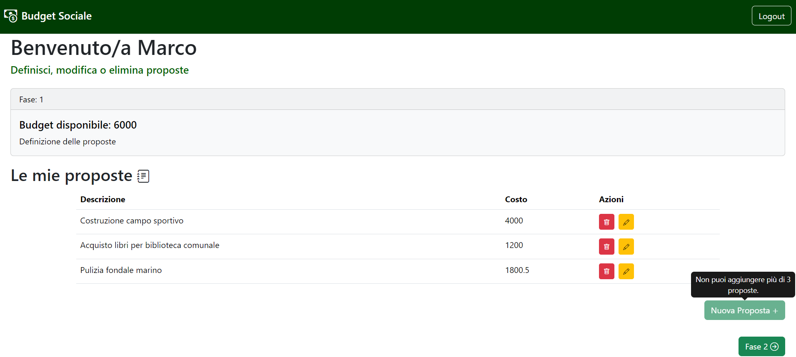

[](https://classroom.github.com/a/OLXYiqlj)
# Exam #2: "Budget Sociale"
## Student: s334493 PROFILO MARCO 

## React Client Application Routes

- Route `/login`: pagina che gestisce il login dell'utente inserendo le credenziali (email e password)
- Route `/`: prima pagina subito dopo il login. Il suo contenuto varia in base alla fase corrente e al fatto che l'utente sia loggato o meno.
- Route `/setbudget`: pagina che permette all'admin di impostare un budget e passare alla fase 1
- Route `/myproposals`: pagina che visualizza e gestisce le proposte create dall'utente loggato
- Route `/addproposal`: pagina che gestisce il form per aggiungere una nuova proposta
- Route `/editproposal/:proposalId`: pagina che gestisce il form per modificare una proposta precedentemente creata, "proposalId" è l'id della proposta da modificare
- Route `/allproposals`: pagina visualizzata dopo il login se si è in fase 2, in un elenco sono presenti tutte le proposte presenti nel database. Le proposte che non sono scritte dall'user loggato possono essere votate con una preferenza da 1 a 3
- Route: `/mypreferences`: pagina che visualizza le proposte con le preferenze espresse dall'utente loggato
- Route: `/approvedproposals`: pagina renderizzata in fase 3, visualizza l'elenco delle proposte approvate in ordine di punteggio totale ottenuto
- Route: `/notapprovedproposals`: pagina che visualizza l'elenco delle proposte non approvate in ordine di punteggio totale ottenuto
- Route: `/notlogged`: pagina renderizzata quando l'utente non è ancora loggato. 
  - Nelle fasi 0-2 mostrerà un messaggio che spiega che la definizionde delle proposte è ancora in corso. 
  - Nella fase 3 mostrerà l'elenco delle proposte approvate
- Route `*`: comprende tutte le route diverse da quelle sopra elencate mostra un immagine 404 Not Found e un pulsante per navigare alla home (/)

## API Server

- POST `/api/sessions`
  - Description: Esegue il login di un utente con le credenziali fornite
  - Request body: 
  ``` json
  {
    "username": "francesca.bianchi@gmail.com",
    "password": "abcd"
  }
  ```
  - Response: `200 OK` (success)
  - Response body: 
  ``` json
  {
    "id": 1,
    "username": "francesca.bianchi@gmail.com",
    "name": "Francesca",
    "surname": "Bianchi",
    "token": "some-auth-token"
  }
  ```
  - Error responses: `401 Unauthorized` (invalid credentials), `422 Unprocessable Entity` (missing or invalid input), `503 Service Unavailable` (database error)

- GET `/api/sessions/current`
  - Description: Controlla se l'utente è ancora loggato e restituisce le informazioni dell'utente corrente
  - Request body: _None_
  - Response: `200 OK` (success)
  - Response body:
  ``` json
  {
    "id": 1,
    "username": "francesca.bianchi@gmail.com",
    "name": "Francesca",
    "surname": "Bianchi",
    "token": "some-auth-token"
  }
  ```
   - Error responses: `401 Unauthorized` (invalid credentials), `503 Service Unavailable` (database error)

- DELETE `/api/sessions/current`
  - Description: Esegue il logout dell'utente corrente, terminando la sessione
  - Request body: _None_
  - Response: `200 OK` (success)
  - Response body: _None_
  - Error responses: `401 Unauthorized` (invalid credentials), `503 Service Unavailable` (database error)

- GET `/api/proposals/:userId`
  - Description: Recupera tutte le proposte create da uno specifico utente
  - Request body: _None_
  - Response: `200 OK` (success)
  - Response body: Array di proposte
  ``` json
  [
    {
      "id": 1,
      "userId": 2,
      "description": "Acquisto di nuovi libri per la biblioteca comunitaria",
      "cost": 500,
      "approved": 0
    },
    {
      "id": 3,
      "userId": 2,
      "description": "Pulizia villa comunale",
      "cost": 200,
      "approved": 1
    },
    ...
  ]
  ```
  - Error responses: `500 Internal Server Error` (Generic Error), `404 Proposals not found` (Proposals Not Found), `401 Unauthorized` (User Not Authorized - Not Logged)

- GET `/api/proposals/id/:proposalId`
  - Description: Recupera la proposta in base al suo id
  - Request body: _None_
  - Response: `200 OK` (success)
  - Response body: Oggetto Proposal
  ``` json
    {
      "id": 1,
      "userId": 2,
      "description": "Acquisto di nuovi libri per la biblioteca comunitaria",
      "cost": 500,
      "approved": 0
    }
    ```
  - Error responses: `500 Internal Server Error` (Generic Error), `404 Proposals not found` (Proposals Not Found), `401 Unauthorized` (User Not Authorized - Not Logged)

- POST `/api/proposals`
  - Description: Aggiunge una nuova proposta di uno specifico user
  - Request body: Descrizione della proposta da aggiungere
  ``` json
    {
      "description": "Pulizia fondale marino",
      "cost": 450
    }
  ```    
  - Response: `200 OK` (success)
  - Response body: Intera proposta aggiunta
  
  ``` json
  {
    "id": 7,
    "userId": 2,
    "description": "Pulizia fondale marino",
    "cost": 450,
    "approved": 0
  }
  ```
  - Error responses: `409 Proposal Already Exists` (Proposal Already Exists), `422 Unprocessable Entity` (Invalid Input), `503 Service Unavailable` (Database Error), `404 Budget Not Exists` (Budget Not Exist Error), `403 Cost of the proposal greater than the defined budget` (Proposal Greather Than Budget), `401 Unauthorized` (Another user's proposal),  `403 Cost of the proposal greater than the defined budget`, (Already Three Propoposals)

- PUT `/api/proposals/:id`
  - Description: Modifica la proposta di uno specificato utente
  - Request body: descrizione della proposta da modificare
  ``` json
  {
    "description": "Acquisto di nuovi libri per la biblioteca comunale",
    "cost": 300
  }
  ```
  - Response: `200 OK` (success)
  - Response body: Intera proposta aggiunta
  
  ``` json
  {
    "id": "1",
    "userId": 2,
    "description": "Acquisto di nuovi libri per la biblioteca comunale",
    "cost": 300,
    "approved": 0
  }
  ```
  - Error responses: `403 Another user's proposal` (proposal of another user), `422 Unprocessable Entity` (invalid input), `503 Service Unavailable` (database error), `401 Unauthorized` (utente non autorizzato - non loggato)

- DELETE `/api/proposals/:id`
  - Description: Elimina la proposta di un determinato utente
  - Request body: _None_
  - Response: `200 OK` (success)
  - Response body: _None_
  - Error responses:  `401 Unauthorized` (utente non autorizzato - non loggato), `403 Another user's proposal` (proposal of another user), `503 Service Unavailable` (database error)

- GET `/api/proposals`
  - Description: Recupera tutte le proposte presenti nel db
  - Request body: _None_
  - Response: `200 OK` (success)
  - Response body: Array di proposte

  ``` json
  [
    {
      "id": 1,
      "userId": 2,
      "description": "Acquisto di nuovi libri per la biblioteca comunitaria",
      "cost": 500,
      "approved": 0
    },
    {
      "id": 3,
      "userId": 2,
      "description": "Pulizia villa comunale",
      "cost": 200,
      "approved": 1
    },
    ...
  ]
  ```
  - Error responses: `500 Internal Server Error` (generic error), `404 Proposals not found`, `401 Unauthorized` (utente non autorizzato - non loggato)

- POST `/api/proposals/:id/vote`
  - Description: Vota la proposta non propria inserendo una riga nella tabella Vote
  - Request body: 
  ``` json
  {
    "score": 3
  }
  ```
  - Response: `200 OK` (success)
  - Response body: score appena aggiunto
  - Error responses: `500 Internal Server Error` (generic error), `403 You cannot vote your proposal`

- GET `/api/proposals/voted/:id`
  - Description: Recupera tutte le proposte votate da uno specifico utente
  - Request body: _None_
  - Response: `200 OK` (success)
  - Response body: Array di proposte

  ``` json
  [
    {
      "id": 2,
      "description": "Costruzione piscina giochi olimpici",
      "cost": 1800,
      "score": 3
    },
    {
      "id": 15,
      "description": "Pulizia fondale marino",
      "cost": 500,
      "score": 3
    }
  ]
  ```
 - Error responses: `500 Internal Server Error` (generic error), `404 User has not voted on any proposal`, `401 Unauthorized` (utente non autorizzato - non loggato)

- DELETE `/api/proposals/voted/delete/:id`
  - Description: Elimina la preferenza espressa precedentemente da un determinato utente
  - Request body: _None_
  - Response: `200 OK` (success)
  - Response body: _None_
  - Error responses:  `401 Unauthorized` (utente non autorizzato - non loggato), `403 Another user's proposal` (proposal of another user), `503 Service Unavailable` (database error)

- GET `/api/proposal/ordered`
  - Description: Ordina le proposte presenti nel database in base al total_score (somma degli score della stessa proposa) in ordine decrescente
  - Request body: _None_
  - Response: `200 OK` (success)
  - Response body: Array di proposte
  ``` json
  [
    {
      "id": 2,
      "userId": 1,
      "description": "Costruzione piscina giochi olimpici",
      "cost": 1800,
      "approved": 0,
      "total_score": 6
    },
    {
      "id": 1,
      "userId": 2,
      "description": "Acquisto nuovi libri per la biblioteca comunale",
      "cost": 400,
      "approved": 0,
      "total_score": 3
    },
    ...
  ]
  ```
  - Error responses: `401 Unauthorized` (utente non autorizzato - non loggato), `500 Internal Server Error` (generic error), `404 Proposals not found`

- PUT `/api/proposal/approve`
  - Description: Approva le proposte che rientrano nel budget
  - Request body: budget 
  ``` json
    {
      "budget": 3000
    }
  ```
  - Response: `200 OK` (success)
  - Response body: true
  - Error responses: `500 Internal Server Error` (generic error)

- GET `/api/proposal/approved`
  - Description: Recupera le proposte approvate presenti nel database in base al total_score (somma degli score della stessa proposa) in ordine decrescente
  - Request body: _None_
  - Response: `200 OK` (success)
  - Response body: Array di proposte
  ``` json
  [
    {
      "id": 2,
      "description": "Costruzione piscina giochi olimpici",
      "member_name": "Marco Profilo",
      "cost": 1800,
      "total_score": 6
    },
    {
      "id": 1,
      "description": "Acquisto nuovi libri per la biblioteca comunale",
      "member_name": "Francesca Bianchi",
      "cost": 400,
      "total_score": 3
    },
    ...
  ]
  ```
  - Error responses: `500 Internal Server Error` (generic error), `404 Proposals not found`

- GET `/api/proposal/notApproved`
  - Description: Recupera le proposte non approvate presenti nel database in base al total_score (somma degli score della stessa proposa) in ordine decrescente
  - Request body: _None_
  - Response: `200 OK` (success)
  - Response body: Array di proposte
  ``` json
  [
    {
      "id": 17,
      "description": "Costruzione area giochi per bambini",
      "cost": 1150,
      "total_score": 2
    },
    {
      "id": 16,
      "description": "Costruzione campi sportivi",
      "cost": 1800,
      "total_score": 0
    }
  ]
  ```
  - Error responses: `401 Unauthorized` (utente non autorizzato - non loggato), `500 Internal Server Error` (generic error), `404 Proposals not found`

- DELETE `/api/proposal/restart`
  - Description: Svuota la tabella Vote, la tabella Proposal e la tabella Budget
  - Request body: _None_
  - Response: `200 OK` (success)
  - Response body: true
  - Error responses:  `401 Unauthorized` (utente non autorizzato - non loggato), `403 Only the admin can do the reset` (not admin), `503 Service Unavailable` (database error)

- POST `/api/init`
  - Description: Inizializza l'applicazione inserendo un nuovo budget e la fase a 0
  - Request body: Amount del budget
  ``` json
  {
    "amount": 3000
  }
  ```
  - Response: `200 OK` (success)
  - Response body: oggetto BudgetSociale
  ``` json
  {
    "id": 1,
    "amount": 3000,
    "current_fase": 0
  }
  ```
  - Error responses: `401 Unauthorized` (utente non autorizzato - non loggato), `403 Only the admin can insert the budget` (not admin), `503 Service Unavailable` (database error)

- GET `/api/budgetandfase`
  - Description: Recupera il budget e la fase attuale
  - Request body: _None_
  - Response: `200 OK` (success)
  - Response body: budget
  ``` json
  {
    "id": 1,
    "amount": 3000,
    "current_fase": 0
  }
  ```
  - Error responses: `401 Unauthorized` (utente non autorizzato - non loggato), `503 Service Unavailable` (database error), `404 Budget not found` (budget not exist)

- PUT `/api/nextfase`
  - Description: Avanza di uno la fase
  - Request body: _None_
  - Response: `200 OK` (success)
  - Response body: true
  - Error responses: `401 Unauthorized` (utente non autorizzato - non loggato), `503 Service Unavailable` (database error), `403 Only the admin can insert the budget or next phase` (not admin error budget), `404 Budget not found` (budget not exist), `403 The phase not allowed` (Fase error)


## Database Tables

- Table `Users` - tabella che contiene gli utenti presenti nel database. Formata da: id, name, surname, role, username(email), password, salt
- Table `Proposal` - tabella che contiene le proposte presenti nel database. Formata da: id, user_id, description, cost, approved
- Table `Vote` - tabella usata per legare la relazione tra User e Proposal, contiene user_id, proposal_id, che sono chiavi esterne, e l'attributo score che indica il punteggio dato dall'utente
- Table `BudgetSociale` - tabella che contiene una sola istanza formata da id, amount (budget) e la fase corrente (current_fase)

## Main React Components

- `Phase0Page`: componente che gestisce la prima pagina dopo la login prima della fase 0 in base al ruolo dell'utente.
  - Se l'user è admin visualizza un form per inserire il budget e un bottone per avanzare la fase
- `Phase1Page`: componente che gestisce la pagina contentente le proprie proposte, con la possibilità di aggiungere, modificare o eliminare una proposta.
  - Anche in questo caso se l'user è admin visualizza un bottone per avanzare la fase
- `MyProposalsTable` (in `Phase0Page`): componente che visualizza la tabella delle proprie proposte con la possibilità di eliminare o modificare una proposta
- `AddEditProposalForm`: componente che gestisce l'aggiunta o la modifica di una proposta in base alla prop 'mode' (edit o add)
- `Phase2Page`: componente che mostra tutte le proposte con la possibilità di esprimere una preferenza per le proposte create da altri utenti
  - Anche in questo caso se l'user è admin visualizza un bottone per avanzare la fase
- `MyPreferences`: componente che mostra le proprie preferenze con la possibilità di eliminarle
- `Phase3Page`: componente che mostra le proposte approvate in base ai criteri descritti dalla traccia d'esame. 
  - Questo componente è visibile anche agli utenti non loggati se si è in fase 3
  - In questo caso se l'user è admin visualizza un bottone riavviare e resettare il processo partendo dalla fase 0
- `NotApprovedProposalsPage`: componente che mostra le proposte non approvate.
  - Questo componente, invece, non è visibile all'utente non loggato
- `NotLoggedPage`: componente visualizzato quando si è nella home (/) ma l'utente non è loggato
  - Fase 0-2: l'user non loggato visualizza una scritta che lo informa che la fase di definizione dell proposte è ancora in corso
  - Fase 3: l'user  non loggato visualizza le proposte approvate senza la possibilità di navigare verso quelle non approvate

## Screenshot




## Users Credentials

|         email               |   name   |  surname  |   role   | plain-text password|
|-----------------------------|----------|-----------|----------|--------------------|
| marco.profilo@gmail.com     | Marco    | Profilo   | Admin    |1234                |
| francesca.bianchi@gmail.com | Francesca| Bianchi   | Member   |abcd                |
| mario.verdi@gmail.com       | Mario    | Verdi     | Member   |abcd                |
| federico.grasso@gmail.com   | Federico | Grasso    | Member   |abcd                |
